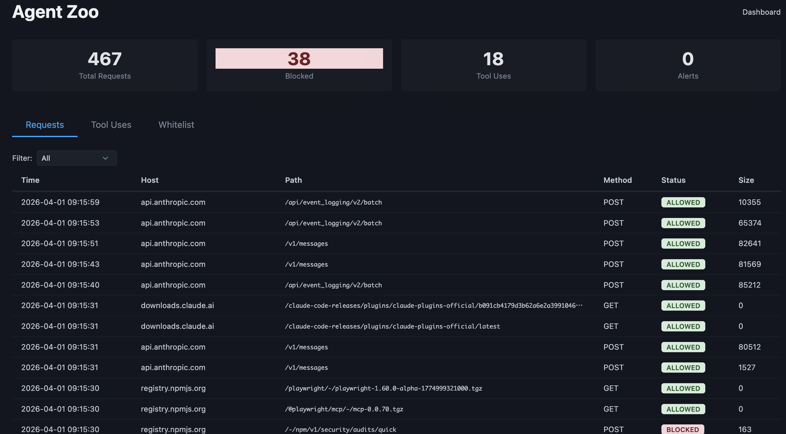
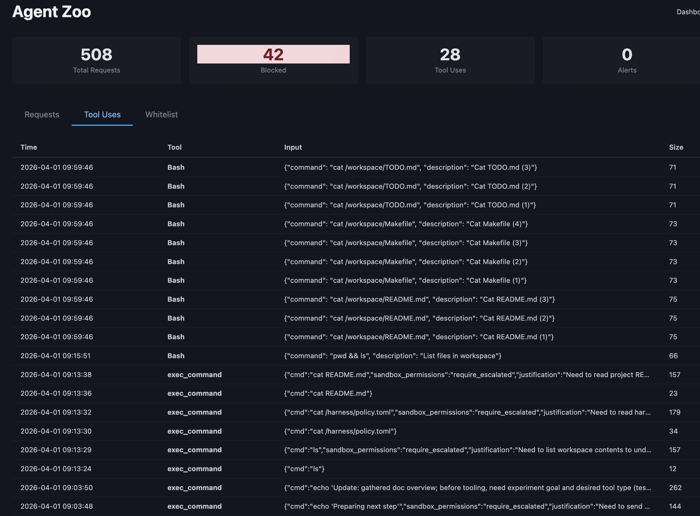
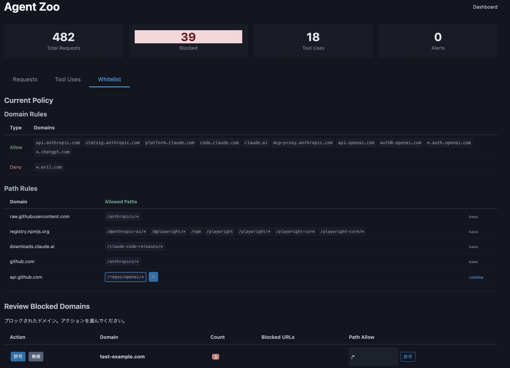

<p align="center">
  
</p>

# Agent Zoo

AIコーディングエージェントを安全に自律実行するためのセキュリティハーネス。

mitmproxyペイロード検査 + TOMLポリシー制御。エージェント非依存で動作。

## モード

- **スタンドアロン** — プロキシのみ起動（`make host`）。ホスト上の任意のエージェントに適用可能
- **Docker Compose隔離** — `internal: true` ネットワークでエージェントを隔離。「読めても送れない」
  - 対応済み: Claude Code, Codex CLI

## 特徴

- **ペイロード検査** — mitmproxyで通信を傍受・検査・ブロック（Base64デコード対応）
- **tool_use検知+ブロック** — エージェントの行動をリアルタイム抽出、危険な実行を阻止
- **ダッシュボード** — WebUIでリアルタイム監視 + ホワイトリスト育成
- **箱庭運用** — 全遮断→ログ分析→段階的に許可のサイクルをAI支援で回す

## クイックスタート

```bash
# PyPI からインストール（公開後）
uv tool install agent-zoo
# もしくは clone 経由
git clone https://github.com/ymdarake/agent-zoo.git
cd agent-zoo
uv tool install .

# Claude Code: 対話モード（初回は /login 必要）
zoo run --workspace /path/to/my-project

# Codex CLI: 対話モード（初回は codex login 必要）
zoo run --agent codex --workspace /path/to/my-project

# 自律実行モード
CLAUDE_CODE_OAUTH_TOKEN=xxx zoo task -p "テストを追加して"
OPENAI_API_KEY=xxx zoo task --agent codex -p "テストを追加して"

# ダッシュボード: http://localhost:8080
```

`uv tool install` を使わない場合は `uv run zoo ...` でも実行できる。Makefile も引き続き利用可能（`make run` など）。

## コマンド

`zoo`（推奨）と `make`（従来互換）どちらでも同じことができます。

| 操作 | zoo | make |
|---|---|---|
| 対話モード | `zoo run [-a claude\|codex] [-w PATH]` | `make run` / `AGENT=codex make run` |
| 箱庭モード（承認なし） | `zoo run --dangerous` | `make run-dangerous` |
| 自律実行（非対話） | `zoo task -p "..." [-a ...] [-w ...]` | `make task PROMPT="…"` |
| サービス起動のみ | `zoo up [--dashboard-only] [--strict]` | `make up-dashboard` / `make up-strict` |
| 停止 | `zoo down` | `make down` |
| policy 反映 | `zoo reload` | `make reload` |
| イメージビルド | `zoo build [-a ...]` | `make build` |
| CA 証明書生成 | `zoo certs` | `make certs` |
| ホストモード | `zoo host start` / `zoo host stop` | `make host` / `make host-stop` |
| ログクリア | `zoo logs clear` | `make clear-logs` |
| ログ分析 | `zoo logs analyze` / `summarize` / `alerts` / `candidates` | `make analyze` / `summarize` / `alerts` / `candidates` |
| テスト | `zoo test unit` / `zoo test smoke` | `make unit` / `make test` |

`zoo --help` / `zoo <cmd> --help` で詳細を確認できます。

## ダッシュボード

`make up-dashboard` で起動（ http://localhost:8080 ）。

リクエスト・tool_use・ブロックをリアルタイム監視し、ホワイトリストを育成できる。

| Requests | Tool Uses | Inbox | Whitelist |
|---|---|---|---|
|  |  | _(ADR 0001)_ |  |

**Inbox**（[ADR 0001](docs/adr/0001-policy-inbox.md)）: エージェントが必要と判断した通信許可リクエストを human-in-the-loop で承認・反映する。

## ドキュメント

| ドキュメント | 内容 |
|---|---|
| [アーキテクチャ](docs/architecture.md) | コンポーネント、データフロー、内部設計 |
| [ADR 0001 Policy Inbox](docs/adr/0001-policy-inbox.md) | Policy Inbox の設計判断（ファイル形式、atomic write、dedup、lifecycle） |
| [Codex統合ガイド](docs/codex-integration.md) | Codex CLI対応の構成と実装メモ |
| [セキュリティモデル](docs/security.md) | 多層防御、既知の制約、運用原則 |
| [ポリシーリファレンス](docs/policy-reference.md) | policy.toml全設定項目 |
| [BACKLOG](BACKLOG.md) | issue grooming + タスク詳細プラン |
| [ROADMAP](ROADMAP.md) | 未実装機能・将来計画 |

## ライセンス

MIT
