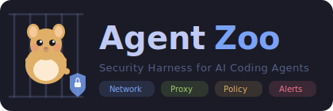

<p align="center">
  
</p>

# Agent Zoo

AIコーディングエージェントを安全に自律実行するためのセキュリティハーネス。

Docker Compose隔離 + mitmproxyペイロード検査 + TOMLポリシー制御。Claude Code, Codex CLI, Aider, Cline等、エージェント非依存で動作。

## 特徴

- **ネットワーク隔離** — Docker `internal: true` で直接外部通信を遮断。「読めても送れない」
- **ペイロード検査** — mitmproxyで通信を傍受・検査・ブロック（Base64デコード対応）
- **tool_use検知+ブロック** — エージェントの行動をリアルタイム抽出、危険な実行を阻止
- **ダッシュボード** — WebUIでリアルタイム監視 + ホワイトリスト育成
- **箱庭運用** — 全遮断→ログ分析→段階的に許可のサイクルをAI支援で回す

## クイックスタート

```bash
git clone https://github.com/ymdarake/agent-zoo.git
cd agent-zoo

# 対話モード（初回は /login 必要）
WORKSPACE=/path/to/my-project make run

# 自律実行モード
CLAUDE_CODE_OAUTH_TOKEN=xxx make task PROMPT="テストを追加して"

# ダッシュボード: http://localhost:8080
```

## コマンド

```bash
make run              # 対話モード
make task PROMPT="…"  # 自律実行
make reload           # policy.toml反映
make down             # 停止
make host             # ホストモード（Docker不要）
make analyze          # AI支援ログ分析（ブロックログ→改善提案）
make summarize        # tool_use履歴→最小権限設定提案
make alerts           # アラート分析
make clear-logs       # ログクリア
make unit             # テスト（144件）
make test             # Dockerスモークテスト
```

## ドキュメント

| ドキュメント | 内容 |
|---|---|
| [アーキテクチャ](docs/architecture.md) | コンポーネント、データフロー、内部設計 |
| [セキュリティモデル](docs/security.md) | 多層防御、既知の制約、運用原則 |
| [ポリシーリファレンス](docs/policy-reference.md) | policy.toml全設定項目 |
| [ROADMAP](ROADMAP.md) | 未実装機能・将来計画 |

## ライセンス

MIT
